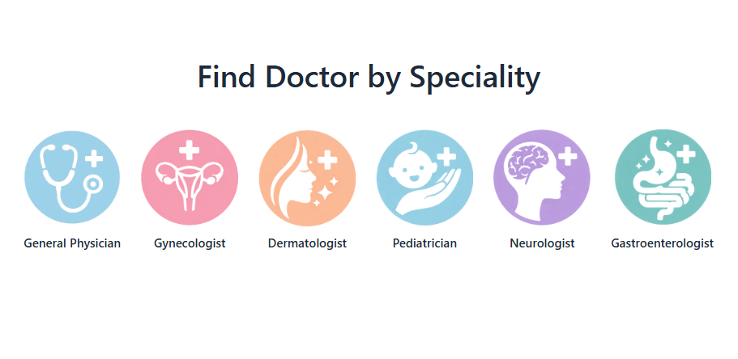
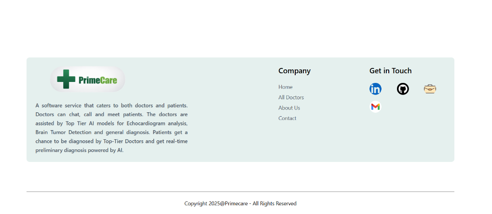

# Full Stack Healthcare System with AI Diagnostics

  <a href="https://harshalchalke31.github.io/fullstack_healthcare_system/" style="text-decoration: none;">
    
      Project
    
  </a>

  <a href="https://harshalchalke31.github.io/harshalchalke31/" style="text-decoration: none;">
    
      Portfolio
    
  </a>

  <a href="https://www.linkedin.com/in/harshalchalke31/" style="text-decoration: none;">
    
      LinkedIn
    
  </a>

  <a href="https://github.com/harshalchalke31/harshalchalke31" style="text-decoration: none;">
    
      Github
    
  </a>

## Preview

<table>
  <tr>
    <td></td>
    <td></td>
    <td></td>
  </tr>
  <tr>
    <td></td>
    <td></td>
    <td></td>
  </tr>
</table>

## Introduction

This project is a full stack healthcare platform that integrates AI based medical imaging analysis directly into clinical workflows. The system enables doctors to manage appointments, conduct consultations, execute imaging diagnostics, and store validated results within structured patient records through a unified web interface.

The platform bridges the gap between research driven deep learning models and production grade healthcare systems by exposing advanced computer vision models as independent inference services. These services can be triggered on demand during clinical workflows, allowing clinicians to interact with AI generated insights in a controlled and reviewable manner.

This project demonstrates how applied AI systems can be engineered beyond isolated experimentation and responsibly embedded into real world healthcare applications.

---

## Skills and Technologies Used

### Frontend

<table>
  <tr>
    <td align="center" width="120">
      
       React
    </td>
    <td align="center" width="120">
      
       HTML
    </td>
    <td align="center" width="120">
      
       CSS
    </td>
    <td align="center" width="120">
      
       JavaScript
    </td>
  </tr>
</table>

### Backend

<table>
  <tr>
    <td align="center" width="140">
      
       Node.js
    </td>
    <td align="center" width="140">
      
       Express
    </td>
  </tr>
</table>

### Artificial Intelligence and Machine Learning

<table>
  <tr>
    <td align="center" width="140">
      
       Python
    </td>
    <td align="center" width="140">
      
       PyTorch
    </td>
    <td align="center" width="140">
      
       PyTest
    </td>
  </tr>
</table>

### Data and Storage

<table>
  <tr>
    <td align="center" width="140">
      
       MongoDB
    </td>
  </tr>
</table>

### DevOps and Tooling

<table>
  <tr>
    <td align="center" width="140">
      
       Docker
    </td>
    <td align="center" width="140">
      
       GitHub
    </td>
  </tr>
</table>

---

## System Architecture

The system follows a modular service oriented architecture to ensure scalability and maintainability.

The frontend provides role based dashboards for doctors, patients, and administrators. All application logic including authentication, scheduling, record management, and authorization is handled by the backend service.

AI models are deployed as independent inference services. When a clinician initiates a diagnostic task, the backend routes the request to the appropriate model endpoint. The inference service processes the imaging data and returns segmentation masks and associated metadata. These results are rendered in the doctor dashboard, where they can be reviewed and approved before being persisted into the patient medical record.

This separation of concerns enables clean integration between research models and production systems while allowing each component to evolve independently.

---

## Models Used

### Echocardiogram Analysis Model

This module uses a lightweight 3D MobileNetV3 based architecture trained on the EchoNet Dynamic dataset. The model performs echocardiogram segmentation with high computational efficiency while maintaining strong segmentation accuracy. It is optimized for deployment as a real time inference service suitable for interactive clinical workflows.

The echocardiogram model is integrated into the platform as an external research driven endpoint.

### Brain Tumor Segmentation Model

This module uses a 3D UNet architecture trained on full MRI volumes from the BraTS dataset. The model generates voxel level tumor segmentation masks that can be visually inspected by clinicians. It is exposed as a separate inference endpoint and seamlessly integrated into the platform workflow.

Both models are treated as independent research services and consumed by the system through standardized APIs.

---

## Conclusion

This project illustrates how advanced AI research can be translated into a usable healthcare platform through careful system design and full stack engineering. The focus extends beyond model accuracy to include workflow integration, interpretability, and clinician oversight.

The system serves as a demonstration of applied AI engineering where machine learning models are positioned as decision support tools within structured and reviewable clinical processes.

---

## Useful Links

- EchoFrame research repository  
  https://github.com/harshalchalke31/echoframe_capstone

- Brain tumor segmentation research repository  
  https://github.com/harshalchalke31/brain_tumor_segmentation

- Author GitHub  
  https://github.com/harshalchalke31

- LinkedIn  
  https://linkedin.com/in/harshalchalke31
